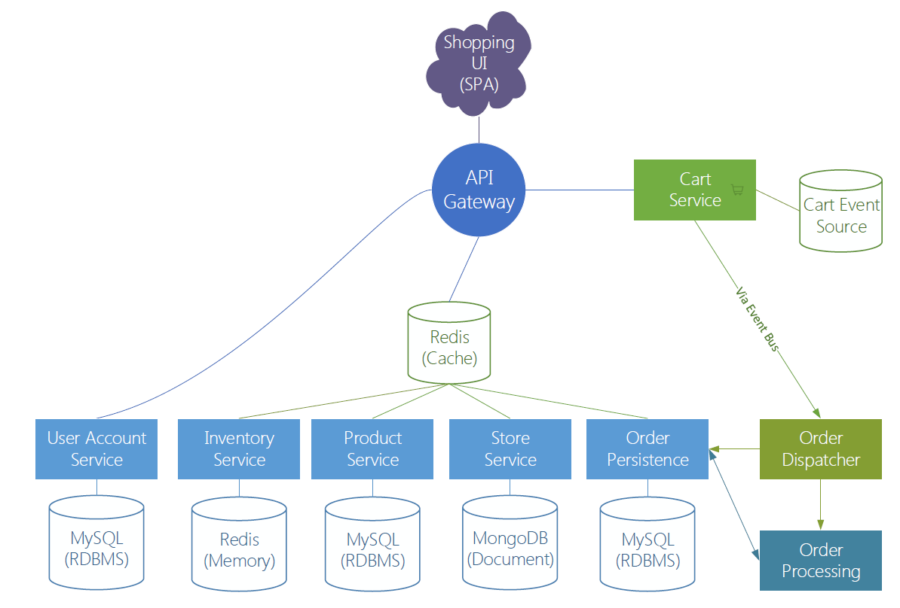

# Vert.x Microservice Blueprint

[](https://travis-ci.org/sczyh30/vertx-blueprint-microservice)

Vert.x blueprint application - A micro-shop microservice application developed with Vert.x.
This repo is intended to be an illustration on how to develop microservice applications using Vert.x.

## Content

- Microservice with Vert.x
- Asynchronous development model
- Reactive and functional patterns
- Event sourcing patterns
- Asynchronous RPC on the clustered event bus
- Various type of services (e.g. REST, message source, event bus service)
- Service discovery
- Circuit breaker
- Polyglot persistence support
- API gateway
- Global authentication (OAuth 2 + Keycloak)
- Monitoring

## Documentation

Detailed tutorials are available here!

- English Version
    - [Vert.x Blueprint - Micro Shop microservice practice (Development)](http://sczyh30.github.io/vertx-blueprint-microservice/index.html)
    - [Vert.x Blueprint - Micro Shop microservice practice (API Gateway)](http://sczyh30.github.io/vertx-blueprint-microservice/api-gateway.html)
- 中文版本
    - [Vert.x 蓝图 - Micro Shop 微服务实战 (开发篇)](http://sczyh30.github.io/vertx-blueprint-microservice/cn/index.html)
    - [Vert.x 蓝图 - Micro Shop 微服务实战 (API Gateway)](http://sczyh30.github.io/vertx-blueprint-microservice/cn/api-gateway.html)

## Architecture



## Docker Machine setup for OSX / Windows (cygwin)

 - Add a new entry to /etc/hosts (facilitates configuration):

```
192.168.99.100 dockernet
```

Where the IP is your `docker-machine ip`. 
Use dockernet or any other name to specify the lookup name for docker-machine host.

 - Set docker external IP
 
Edit `api-gateway/src/config/docker.json` and set `api.gateway.http.address.external` property to `dockernet`.
If you choose to use a different lookup name than you'll have to update `docker/docker-compose.yml` line `- "dockernet:${EXTERNAL_IP}"` and replace __dockernet__ with your hostname of choice.

In addition, the following docker-machine properties need to be set for ELK stack to work:

```
docker-machine ssh
sudo sysctl net.ipv4.ip_forward
sudo sysctl -w vm.max_map_count=262144
```

Memory might be an issue as well. If applications start failing because memory could not be allocated, then you'll need to increase your docker-machine memory using the following steps:

 1. Stop docker-machine: `docker-machine stop`
 1. Start VirtualBox
 1. Select `default` VM
 1. Choose Settings->System
 1. Increase `Base Memory` (I had to increase from 2048 to 4096 MB) 
  
## Build/Run

First, for `api-gateway` and `monitor-dashboard` component, you have to enter the `src/main/resources/webroot` directory and install the frontend dependencies with **bower**:

```
bower install
```

Then build the code:

```
mvn clean install -Dmaven.test.skip=true
```

To run the microservice with Docker Compose, please refer to the [run instruction](http://www.sczyh30.com/vertx-blueprint-microservice/index.html#show-time-).

## Contributing

Contributions are definitely welcome !
